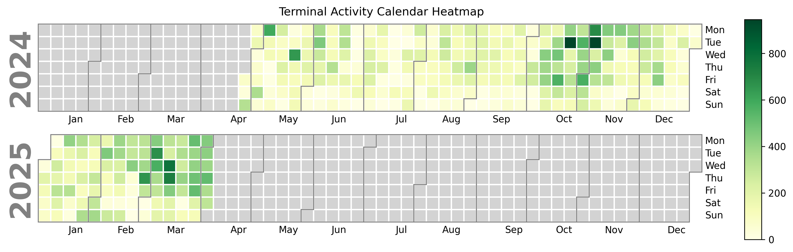

# Terminal Activity Heatmap
This project generates a calendar-style heatmap of terminal activity.

## Example


## Background
This project generates a calendar-style heatmap of terminal activity, based on a history file created by a shell like Bash. It visualizes the frequency of commands executed on different days, helping you track your terminal usage over time.

## Features
- Parses shell history to extract timestamps of executed commands
- Creates a calendar heatmap using the calplot library
- Provides an easy way to see activity patterns in the terminal

## Installation
### Prerequisites
- Python 3.6+
- pip for installing Python dependencies

### Install Dependencies
Clone this repository and install the required dependencies:
```
git clone https://github.com/bramgn/terminal-activity-heatmap.git
cd terminal-activity-heatmap
pip install -r requirements.txt
```

## Usage
1. Edit the history_file variable to the correct path for your shell.
```
history_file = "~/.bash_history"
```
2. Once the dependencies are installed run the script:
```
python heatmap.py
```

This will generate a calendar heatmap of your shell activity and save it as bash_history_heatmap.png in the current directory.

## License
This project is licensed under the MIT License - see the LICENSE file for details.

